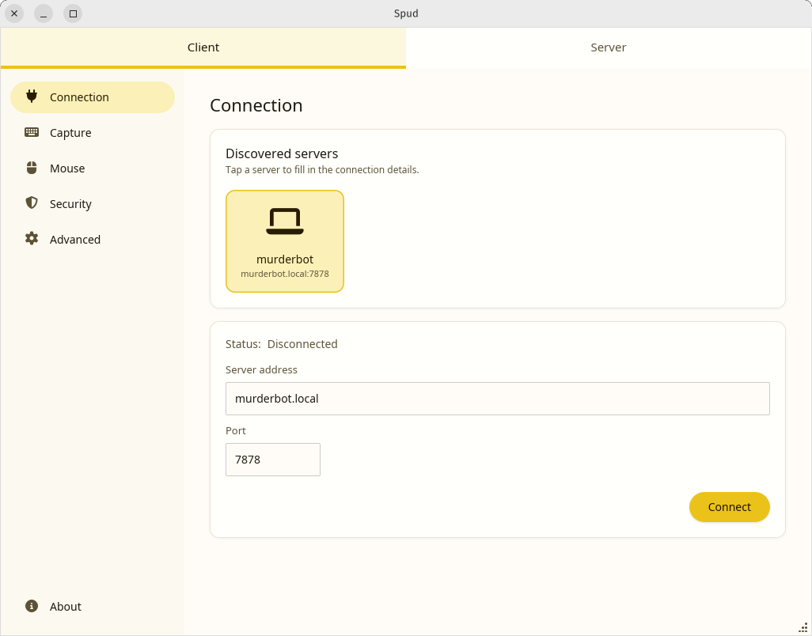
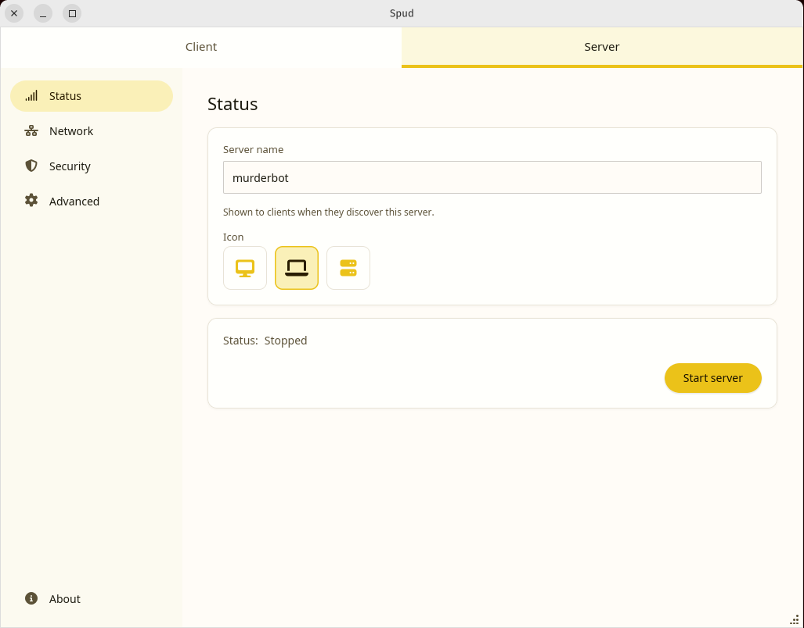

# Spud


Spud solves the problem of wanting to play games on a computer attached your TV, from a laptop on your couch.
It's a cross-platform remote control application that sends local input to a remote server, and is optimised for gaming, meaning that input is as low latency as possible.
As it's intended to be used in a situation where you can already see the output from the server on another device, it doesn't accept video or sound output from the server.

## Why use Spud?

There already exist tools that solve similar problems to Spud, so why not use them instead?

* [Synergy](https://symless.com/synergy) is a great tool for remote control, but its latency makes it unsuitable for gaming.
* [Parsec](https://parsec.app/) is fantastically optimised and easy to set up, but it's too heavyweight when you don't need video sent back to the controlling device.
* [Moonlight/Sunlight](https://moonlight-stream.org/) are brilliant projects, but can be difficult to set up and don't support specific features of this use case.


## Features

* Simple UI
* Cross-platform (WIP)
* Low latency input streaming
* Input capture toggling by hotkey
* Absolute or relative pointer movement
* LAN discovery
* Optional local screen blanking on input capture
* Tolerance of poor network conditions
* Optional password protection and [encryption](docs/encryption.md)

## Supported platforms

* Linux
  * X11
  * Wayland (Gnome, KDE, COSMIC, possibly more!)
* macOS
  * Tested on Tahoe (26)
* Windows support comming soon!

## Install

### Linux

Binaries are available from the GitHub project [releases](https://github.com/xfoa/spud/releases) page.
Put them wherever your system expects to find binaries.

On **Linux**, the server can inject input events via a privileged helper that
runs through `pkexec`. To start the server without having to enter your
password (eg if starting on boot), install the polkit rule:

```bash
sudo install -Dm644 resources/50-spud-injection.pkla \
    /etc/polkit-1/localauthority/50-local.d/50-spud-injection.pkla
```

Alternatively, run the provided install script which also builds and installs
the binary and desktop entry:

```bash
./install.sh
```

### macOS

At the moment only available via `cargo run`. Better options coming soon! 

On **macOS**, fullscreen/hotkey input capture requires **Accessibility**
permission (and **Input Monitoring** permission on macOS 10.15+). The app
will prompt you to enable these in System Settings when you first attempt
to capture input. Server-side input injection does not require special
permissions.

## Build

You can build this project using:

```
cargo build
```

Then run using:

```
cargo run
```

## Screenshots

### Client



### Server



## Contribute

Please feel free to [open issues](https://github.com/xfoa/spud/issues), create [PRs](https://github.com/xfoa/spud/pulls), and [fork](https://github.com/xfoa/spud/fork) this project!

## License

This project is distributed under the [GPL-3.0](https://www.gnu.org/licenses/gpl-3.0.en.html) license.