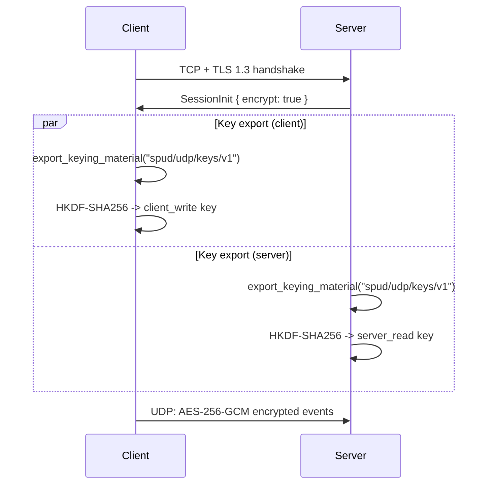

# UDP Encryption

This document describes the optional UDP encryption layer in Spud. The control
plane (TCP) is always protected by TLS 1.3. UDP encryption is an additional,
negotiated layer that protects input events from eavesdropping and tampering on
the LAN.

## Threat model

* **Passive attacker on the LAN** (packet sniffing): encryption hides key
  names, mouse deltas, and timing of input events.
* **Active attacker** (packet injection / replay): authenticated encryption
  (AES-256-GCM) plus a replay window prevents forgery and replay of old
  packets.
* **Trust on first use (TOFU)**: the first connection to a server pins its
  certificate fingerprint. An attacker who cannot compromise the server's
  private key cannot impersonate it on subsequent connections.

The encryption layer does **not** protect against:
* A compromised server (it sees decrypted events).
* A malicious client connecting to a legitimate server (authorization is a
  separate, not-yet-implemented layer).
* Traffic analysis (packet sizes and timing are not padded or obfuscated).

## Overview



Both sides derive the same keying material from the TLS 1.3 exporter, then
split it into two unidirectional keys. The client encrypts with
`client_write`; the server decrypts with `server_read`. The reverse direction
(`server_write` / `client_read`) is reserved for future server-to-client
traffic (e.g. clipboard sync).

## Key derivation

### TLS exporter

After the TLS 1.3 handshake completes, both sides call
`export_keying_material` on the underlying `rustls` connection:

* **Label**: `b"spud/udp/keys/v1"`
* **Context**: `Some(b"")` (empty context)
* **Output length**: 64 bytes

The exporter is a standard TLS 1.3 feature that produces cryptographically
independent keying material from the master secret. An attacker who can read
network traffic but does not hold the TLS session keys cannot derive these
values.

### HKDF expansion

The 64-byte exported material is fed into `Hkdf::<Sha256>` (HKDF-SHA256) with
no separate salt:

```
HKDF-Expand(exported_material, "client-write", 32) -> client_write key
HKDF-Expand(exported_material, "server-write", 32) -> server_write key
```

Both sides run the same HKDF with the same labels, so they arrive at identical
keys. The exported material is `Zeroize`d immediately after expansion. The
resulting `UdpKeys` struct derives `ZeroizeOnDrop` so keys are cleared from
memory when the session state is dropped.

## AES-256-GCM

Each UDP event is encrypted independently with AES-256-GCM.

### Nonce generation

A random 96-bit (12-byte) nonce is generated with `OsRng` for every packet.
The nonce is transmitted in cleartext as part of the packet (see layout
below). GCM's security bound accommodates large numbers of random nonces for a
single key, and the key is re-derived on every TLS session.

### Additional authenticated data (AAD)

The 64-bit sequence number is bound as AAD:

```rust
let aad = seq.to_le_bytes(); // 8 bytes, little-endian
```

This prevents an attacker from cutting-and-pasting ciphertext blocks between
packets with different sequence numbers.

### Encryption

```rust
pub fn encrypt_event(cipher: &Aes256Gcm, seq: u64, plaintext: &[u8]) -> Result<Vec<u8>, _> {
    let nonce = Aes256Gcm::generate_nonce(&mut OsRng); // 12 bytes
    let payload = Payload { msg: plaintext, aad: &seq.to_le_bytes() };
    let ciphertext = cipher.encrypt(&nonce, payload)?;
    // result = nonce || ciphertext
}
```

### Decryption

```rust
pub fn decrypt_event(cipher: &Aes256Gcm, seq: u64, nonce_ct: &[u8]) -> Option<Vec<u8>> {
    // nonce_ct must be at least 12 (nonce) + 16 (tag) bytes
    let nonce = &nonce_ct[..12];
    let ciphertext = &nonce_ct[12..];
    let payload = Payload { msg: ciphertext, aad: &seq.to_le_bytes() };
    cipher.decrypt(nonce, payload).ok()
}
```

Decryption returns `None` on any failure (bad nonce length, tag mismatch,
wrong AAD). The caller must drop the packet; no plaintext fallback is
permitted.

## UDP packet layouts

### Plaintext (encryption disabled)


### Encrypted (encryption enabled)


* `ConnId`: session identifier received in `SessionInit`.
* `Seq`: monotonically increasing 64-bit sequence number per packet,
  starting at 1. Used for replay protection and as AAD.
* `Nonce`: 12-byte random AES-GCM nonce.
* `Ciphertext`: `postcard(Event)` encrypted with AES-256-GCM. The 16-byte
  authentication tag is appended by the cipher.

The server extracts `ConnId` and `Seq` from the first 16 bytes, then passes
`nonce || ciphertext` (everything after byte 16) to the decrypt function.

## Replay protection

The server maintains an RFC 4303-style replay window per session. It is a
1024-packet sliding bitmap.

```rust
pub struct ReplayWindow {
    max_seq: u64,
    bitmap: [u64; 16], // 1024 bits
}
```

For each incoming encrypted packet:

1. `seq == 0` is rejected immediately.
2. If `seq > max_seq`: the window shifts forward, `max_seq` is updated, and the
   packet is accepted.
3. If `seq <= max_seq`: compute `diff = max_seq - seq`. If `diff >= 1024`, the
   packet is too old and is rejected. Otherwise, check the bitmap bit for
   `diff`. If already set, it's a duplicate and is rejected. If clear, set the
   bit and accept.

The window is checked **before** decryption. This cheaply drops duplicates
without burning CPU on failed AES-GCM operations.

Plaintext sessions do not use the replay window (there is no authentication to
protect against replay).

## Encryption negotiation

Encryption is a per-session boolean preference on both sides. The server
includes its preference (`encrypt_udp`) in `SessionInit.encrypt`. The client
compares this against its own preference (`client_encrypt`):

| Client | Server | Result                                 |
|--------|--------|----------------------------------------|
| OFF    | OFF    | Connect, plaintext UDP.                |
| ON     | ON     | Connect, encrypted UDP.                |
| OFF    | ON     | Client aborts with mismatch error.     |
| ON     | OFF    | Client aborts with mismatch error.     |

The server has authority: the client must match the server's setting. This is
intentional -- a client that demands encryption should not silently fall back
to plaintext, and a client without encryption should not be able to connect to
a server that requires it.

### Key export failure handling

If TLS key export fails on the client side and the client wants encryption,
`connect()` returns an error (`"Failed to derive encryption keys"`). The same
applies on the server: if export fails, `keys` is `None`, and any encrypted
packet received for that session is dropped with a log message.

## Server session table

The server stores session state in a `DashMap<ConnId, SessionState>`:

```rust
pub struct SessionState {
    pub keys: Option<SessionKeys>,       // decryption keys (if encrypt)
    pub replay_window: ReplayWindow,     // per-session replay window
    pub last_activity: Instant,          // for timeout and keepalive
    pub src_addr: SocketAddr,            // last known UDP source
    pub encrypt: bool,                   // negotiated setting
}
```

Sessions are inserted after TLS accept and `SessionInit` is sent. They are
removed when:
* The TLS stream closes.
* A `cancel` token fires (server shutdown / restart).
* The session is idle for more than `SESSION_TIMEOUT` (300 s).

## Security notes

* **No UDP source-IP filtering by default**: the server identifies packets by
  `ConnId`, not by source IP. NATs and mobile clients may change IP:port
  mappings mid-session; `ConnId` survives this. The trade-off is that any host
  who knows the `ConnId` can inject packets, but they must also pass AES-GCM
  authentication (for encrypted sessions).
* **Key scope**: UDP keys are scoped to a single TLS session. Reconnecting
  generates a new TLS handshake, new exported material, and new UDP keys.
* **Memory safety**: all key material derives `Zeroize` / `ZeroizeOnDrop`. The
  64-byte TLS exported buffer is zeroed immediately after HKDF expansion.
* **Sequence number space**: `u64` provides an effectively inexhaustible space.
  Wrapping is not handled because a session would need to send 2^64 packets
  before it occurs.
* **Nonce collision**: random 96-bit nonces give a negligible collision
  probability for the lifetime of a single session.
