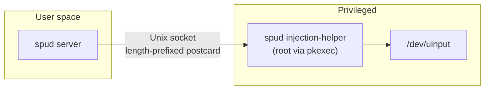

# spud injection-helper

The `spud injection-helper` is a small privileged companion process used on
**Linux** to open `/dev/uinput` and inject input events on behalf of the main
Spud server. Because `/dev/uinput` is typically restricted to root or the
`input` group, the helper runs under `pkexec` so it can acquire the necessary
privileges without requiring the entire GUI application to run as root.

## Architecture



1. The server starts and tries to open `/dev/uinput` directly (Linux only).
2. If that succeeds, the helper is **not** used.
3. If permission is denied, the server spawns:
   ```
   pkexec /path/to/spud injection-helper /tmp/spud-input-{pid}.sock 1920 1080
   ```
4. The helper creates a `kinput` mouse device and an `evdev` virtual device,
   binds the Unix socket, and waits for a single client connection.
5. The server connects to the socket and forwards `InjectCmd` messages.
6. When the server stops (or the connection closes), the helper exits
   automatically.

## IPC protocol

Commands are sent over the Unix socket as length-prefixed
`postcard`-serialized messages:


The 16-bit little-endian length is followed by `postcard(InjectCmd)` bytes.

```rust
pub enum InjectCmd {
    MouseAbs { x: i32, y: i32 },
    MouseRel { dx: i32, dy: i32 },
    KeyDown { code: u16 },
    KeyUp { code: u16 },
    ButtonDown { code: u16 },
    ButtonUp { code: u16 },
    Wheel { dx: i8, dy: i8 },
}
```

* `MouseAbs` -- absolute cursor position in pixels.
* `MouseRel` -- relative mouse delta in pixels.
* `KeyDown` / `KeyUp` -- Linux evdev key codes.
* `ButtonDown` / `ButtonUp` -- Linux evdev button codes.
* `Wheel` -- horizontal and vertical scroll deltas.

## Direct mode (no helper)

If your user is in the `input` group, the server can open `/dev/uinput`
directly and the helper is never spawned. To add yourself:

```bash
sudo usermod -aG input $USER
```

Then log out and back in.

## Polkit authentication caching

By default `pkexec` asks for the root password every time the server starts.
To cache the authorization for the rest of the session, install the provided
polkit rule:

```bash
sudo install -Dm644 resources/50-spud-injection.rules \
    /etc/polkit-1/rules.d/50-spud-injection.rules
```

This returns `AUTH_ADMIN_KEEP` for any `pkexec` invocation whose command line
contains both `spud` and `injection-helper`, so you only need to authenticate
once per desktop session.

## Socket path

The socket is created at `/tmp/spud-input-{pid}.sock` where `{pid}` is the
main spud process ID. The helper `chmod`s the socket to `777` after binding so
the unprivileged server process can connect.

## Helper lifecycle

* One helper instance per server session.
* The helper exits when the Unix socket connection closes (server stopped or
  restarted).
* The server explicitly kills the helper child process when the injector is
dropped, ensuring no root process lingers after shutdown.
