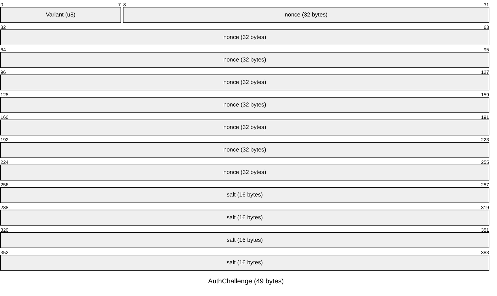
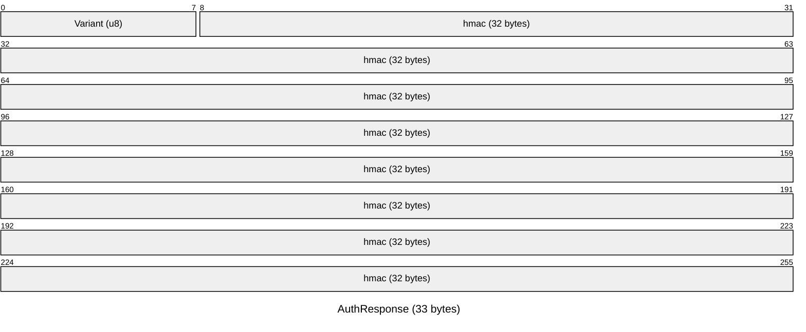
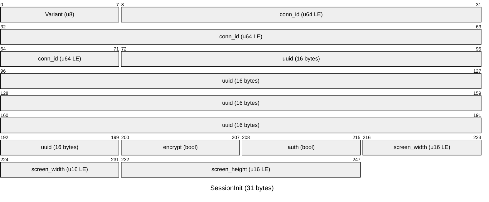
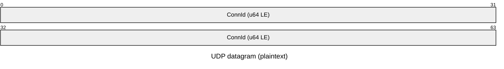
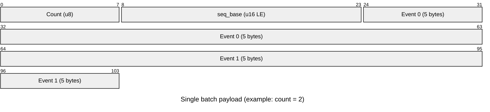
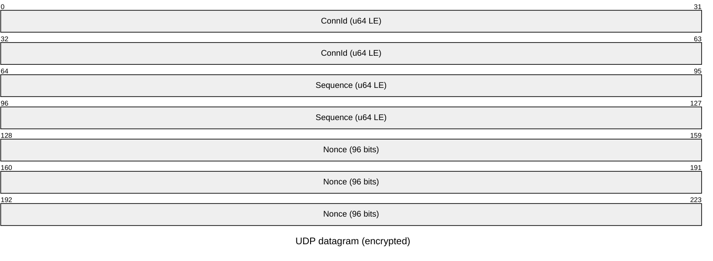
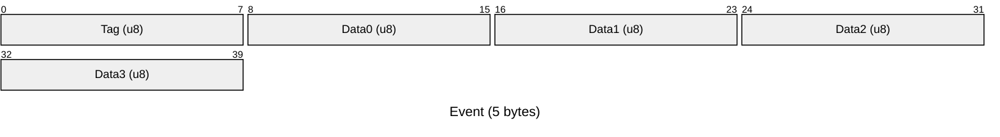

# Wire Protocol

Spud uses two channels between client and server, both on the same configured
port:

* **TCP + TLS 1.3 control plane** for session setup, liveness, and optional
  authentication.
* **UDP input plane** for input events streamed from the client to the server.

A client must complete the TLS handshake and receive a `SessionInit` before its
UDP packets are accepted. The server tracks sessions by `ConnId` (a 64-bit
identifier); UDP datagrams carrying an unknown `ConnId` are silently dropped.

All multi-byte integers are little-endian.

## Constants

| Name                 | Value    | Purpose                                      |
|----------------------|----------|----------------------------------------------|
| `ALPN_PROTOCOL`      | `spud/1` | ALPN identifier for TLS negotiation.         |
| `CONNECT_TIMEOUT`    | `5 s`    | TCP connect budget.                          |
| `TLS_TIMEOUT`        | `10 s`   | TLS handshake budget.                        |
| `HANDSHAKE_TIMEOUT`  | `5 s`    | Budget to receive `SessionInit` after TLS.   |
| `KEEPALIVE_INTERVAL` | `30 s`   | Cadence for `Keepalive` over TLS.            |
| `SESSION_TIMEOUT`    | `300 s`  | Max idle time before server closes session.  |

## Certificates and trust

The server generates a self-signed Ed25519 certificate on first start and
persists it to `~/.config/spud/cert.pem` and `key.pem`. The certificate's
SPKI (Subject Public Key Info) SHA-256 fingerprint is its identity. If x509
parsing fails, the full DER is hashed as a fallback.

The client uses **trust on first use** (TOFU):

1. If the client has no stored fingerprint for `host:port`, it performs a probe
   connection with a permissive verifier, extracts the server's certificate
   fingerprint, stores it in `~/.config/spud/known_servers.toml`, and then
   reconnects using the now-trusted fingerprint.
2. On subsequent connections, the client verifies the server's certificate
   against the stored fingerprint using a constant-time comparison.

If the server's certificate changes, the client refuses to connect until the
user clears the stored fingerprint.

## TCP control plane

### Framing

The TLS stream is framed with `tokio_util::codec::LengthDelimitedCodec`. Every
control message is a length-prefixed payload:


`length` is the size of the payload in bytes. It may be 0 to 65535. The payload
is a `postcard`-serialized `ControlMsg`.

### Control messages

All control messages are `postcard`-serialized. Enums encode as a 1-byte
variant index followed by the struct fields in declaration order. Multi-byte
integers are little-endian. Booleans are 1 byte (`0x00` or `0x01`).









#### `SessionInit` (server -> client)

Sent by the server immediately after the TLS handshake completes (and after any
authentication, if implemented). This is the only message required to begin a
session.


* `conn_id`: opaque 64-bit session identifier. The client must include this in
  every UDP datagram.
* `uuid`: 128-bit session UUID (reserved for future use).
* `encrypt`: the server's UDP encryption preference. The connection is aborted
  if this does not match the client's preference.
* `auth`: `true` if the server required passphrase authentication for this
  session.
* `screen_width` / `screen_height`: server display dimensions in pixels. The
  client uses these to scale absolute mouse coordinates.

#### `Keepalive` (client -> server)

Sent periodically (every 30 s) by the client over the TLS stream to keep the
session alive. The server monitors the stream for EOF and checks idle timeout
every 60 s.


Either side closing the TLS connection terminates the session.

#### `AuthChallenge` (server -> client)

Sent when the server has `require_auth` enabled and a passphrase is configured.


* `nonce`: 32 random bytes.
* `salt`: 16 raw bytes (the Argon2id salt decoded from base64).

The client must respond with an `AuthResponse` within 10 seconds.

#### `AuthResponse` (client -> server)

Sent by the client in reply to `AuthChallenge`.


* `hmac`: HMAC-SHA256 of the 32-byte nonce. The key is the Argon2id hash output
  derived from the user's plaintext passphrase and the salt from `AuthChallenge`.

#### `AuthResult` (server -> client)

Sent after the server verifies the client's `AuthResponse`.


* `ok: true` -- authentication succeeded. The server sends `SessionInit` next.
* `ok: false` -- authentication failed. The server closes the TLS connection.

If the server does not require auth, it skips `AuthChallenge`/`AuthResponse`
and sends `SessionInit` immediately after the TLS handshake.

#### `SetCaptureMode` (client -> server)

Sent by the client when the capture mode changes (e.g. switching between
fullscreen and window mode).


* `window_mode`: `true` when the client is in windowed/focus capture mode;
  `false` when in fullscreen/hotkey capture mode.

#### `SetBatchConfig` (client -> server)

Sent by the client after receiving `SessionInit` and whenever the client's
batch settings change while connected. The server uses these values to size its
deduplication history window:

```
history_capacity = max_batch * batch_redundancy * batch_history_multiplier
```

* `max_batch`: the client's configured mouse batch size (1-20).
* `batch_redundancy`: the number of historical batches the client appends to
each mouse datagram (0-10).

The `batch_history_multiplier` is a server-side setting (default 4, range 1-10)
in Advanced settings.

### Lifecycle

1. Client resolves `host:port` and opens a TCP connection within the connect
   timeout.
2. Client and server perform a TLS 1.3 handshake within the TLS timeout.
   * Server presents its self-signed Ed25519 certificate.
   * Client verifies the certificate against its stored TOFU fingerprint (or
     probes and stores it on first connect).
3. If auth is required, the server sends `AuthChallenge` and waits for
   `AuthResponse`. It verifies the HMAC and sends `AuthResult`.
4. Server sends `SessionInit` containing the session parameters.
5. Client validates `SessionInit.encrypt` against its local preference. If they
   differ, the client aborts the connection.
6. Client sends `SetBatchConfig` with its current `max_batch` and
   `batch_redundancy`.
7. Client binds a UDP socket and may begin sending event datagrams tagged with
   `conn_id`.
8. The client enters a keepalive loop, sending `Keepalive` over TLS every
   30 s. The server monitors the stream for EOF and checks session idle time
   every 60 s; if a session is idle for more than `SESSION_TIMEOUT` (300 s)
   it is closed.
9. When the TLS stream closes, the server removes the session from its table;
   subsequent UDP packets with that `conn_id` are dropped.
10. The client surfaces a TLS EOF or read error as a `Disconnected` event in the
   UI.

## UDP input plane

Only **mouse movement** events (`MouseMove` and `MouseAbs`) are batched. All
other events (key presses, mouse buttons, wheel, heartbeats) are sent
immediately as single-event datagrams. Batching amortises the fixed UDP/IP
header overhead (28 bytes) and `ConnId` prefix across multiple events, which is
critical for high-frequency traffic like mouse movement.

The client buffers mouse events for up to 1 ms or until the configured batch
size (1-20, default 8) accumulates, whichever comes first.

Optionally, the client may append **redundant batches** (0-10, configurable) to
each mouse datagram. These are previously sent mouse batches included for
reliability on lossy networks. Each batch is self-describing with its own
`count` byte, so a server that does not yet use redundancy can simply read the
first batch and ignore the trailing data.

### Plaintext datagram layout



After the 8-byte `ConnId`, the payload is a sequence of self-describing batches.
Each batch has the same layout:



* `count`: number of events in this batch (up to 20 for mouse, always 1 for
  keys, buttons, wheel, and keepalive).
* `seq_base`: the sequence number of the first event in this batch. Event *i*
  has implicit sequence number `seq_base + i` (wrapping `u16` arithmetic).
  Used by the server for batch-level deduplication of redundant history.
* `event`: 5-byte fixed-size encoded event.
* The first batch is the current one. Subsequent batches are optional redundant
  history appended by the client for mouse movement datagrams only. A server
  reads `count`, consumes `2 + count * 5` bytes, and continues to the next batch.

> **Note**: this batch format is not backward-compatible with earlier revisions
> that omitted `seq_base`. Parsers expecting the old `[count: u8][events...]`
> layout will misread `seq_base` as event data. The ALPN identifier (`spud/1`)
> should be bumped if interoperability with pre-redundancy implementations is
> required.

### Encrypted datagram layout



After the 28-byte header, the remainder of the datagram is the
**AES-256-GCM ciphertext** (variable length). The ciphertext decrypts to the
same batch-payload format used in plaintext: `[count: u8][seq_base: u16 LE][events...]`
followed by any redundant batches.

### Compact event encoding

Each event is exactly **5 bytes** (fixed-size for simple parsing):



| Tag | Event | Data layout |
|-----|-------|-------------|
| `0x01` | `KeyDown` | `u16` evdev scancode, `u8` seq |
| `0x02` | `KeyUp` | `u16` evdev scancode, `u8` seq |
| `0x03` | `KeyRepeat` | `u16` evdev scancode, `u8` seq |
| `0x04` | `MouseMove` | `i16 dx`, `i16 dy` |
| `0x05` | `MouseAbs` | `u16 x`, `u16 y` |
| `0x06` | `MouseButton` | `u8 button` in bits 0-6, `pressed` in bit 7 (1 = down, 0 = up) |
| `0x07` | `MouseButtonRepeat` | `u8 button` |
| `0x08` | `Wheel` | `i8 dx`, `i8 dy`, `u8` seq |
| `0x09` | `Keepalive` | unused |

All multi-byte fields are little-endian. Unused trailing bytes are zero.

### Event semantics

* `KeyDown` / `KeyUp` / `KeyRepeat`: carry a `u16` Linux evdev scancode
  (see [Key encoding](#key-encoding)) and a `u8` sequence number.
* `MouseMove`: relative deltas in pixels (`i16` each).
* `MouseAbs`: absolute position normalised to `0..65535`. The server maps this
  to its screen dimensions using `screen_width` / `screen_height` from
  `SessionInit`.
* `MouseButton`: `button` is an evdev-like code (`1`=left, `2`=middle,
  `3`=right, `8`=back, `9`=forward); `pressed` is `1` for down, `0` for up.
* `Wheel`: discrete scroll deltas. Lines are passed through; pixel deltas are
  divided by 10. Both axes are clamped to `i8` range. Also carries a `u8`
  sequence number.
* `KeyRepeat`: sent by the client over UDP as a heartbeat for held keys.
  Not batched.
* `MouseButtonRepeat`: sent by the client over UDP as a heartbeat for held
  mouse buttons. Not batched.
* `Keepalive`: sent by the client over UDP as a lightweight liveness signal.
  Not batched.

### Sequence numbers for keyboard and wheel events

Keyboard events (`KeyDown`, `KeyUp`, `KeyRepeat`) and wheel events (`Wheel`)
carry a per-event `u8` sequence number assigned by the client. The client
increments a `u8` counter for each such event, wrapping on overflow. Sequence
number `0` is reserved for backward compatibility (old clients that do not
assign sequence numbers will have `seq = 0` in these fields).

The server maintains a separate 256-bit bitmap plus circular buffer
(`SeqHistoryU8`) to track recently seen `u8` sequence numbers. When a keyboard
or wheel event arrives with `seq != 0`:
1. If the sequence number is already in the bitmap, the event is a duplicate
   and is dropped.
2. Otherwise, the sequence number is added to the bitmap and the event is
   processed normally.

This prevents duplicate injection when the same UDP packet is delivered twice
or when a redundant batch contains keyboard events. It complements the existing
`u16` batch-level deduplication used for mouse movement events. The circular
buffer has a fixed capacity of 64 entries (much larger than the expected
out-of-order window for keyboard traffic).

## Key encoding

Keys are transmitted as raw **Linux evdev scancodes** (`u16`), not strings.
The client maps physical keys to scancodes using a platform-specific table:

* On Linux, the raw scancode from the OS is used directly (or offset by 8 for
  X11 keycodes).
* For logical `Key::Named` fallbacks (rare), a fixed mapping table translates
  common named keys to their evdev equivalents.
* For `Key::Character` fallbacks (very rare), a US-QWERTY assumption is used.

The server receives the `u16` scancode and passes it straight to the Linux
input subsystem (`/dev/uinput` or the privileged helper), so no string parsing
is required on the hot path.

## Server redundancy deduplication

When the client appends redundant batches to a mouse datagram, the server
processes them in ascending chronological order (oldest first) before handling
the primary batch.

For each redundant batch:
1. Look up the batch's `seq_base` in a 65536-bit bitmap.
2. If the bit is set, the entire batch has already been injected; skip it.
3. If the bit is clear, inject all events in the batch and set the bit.

For the primary (current) batch:
1. Inject all events in the batch unconditionally.
2. If the batch contains mouse events, set its `seq_base` bit in the bitmap.

The bitmap is paired with a fixed-size circular buffer that tracks which
sequence numbers are currently set. When the buffer is full, the oldest entry
is dequeued and its bit is cleared. This provides O(1) check and update with
constant memory. The buffer size is:

```
capacity = max_batch * batch_redundancy * batch_history_multiplier
```

where `batch_history_multiplier` is a server-side setting (default 4).

## Server input state machine

The server maintains two maps: `keys: HashMap<u16, Instant>` for held keys and
`mouse_buttons: HashMap<u8, Instant>` for held mouse buttons. On each datagram
and on each idle tick of the recv loop, it runs the rules below and prints the
resulting actions.

| Incoming event       | Held already? | Action                                                    |
|----------------------|---------------|-----------------------------------------------------------|
| `KeyDown(code)`      | no            | `press name`; insert with current time.                   |
| `KeyDown(code)`      | yes           | `release name (lost up)`, `press name`; refresh time.     |
| `KeyRepeat(code)`    | yes           | `repeat name`; refresh time.                              |
| `KeyRepeat(code)`    | no            | (ignored)                                                 |
| `KeyUp(code)`        | yes           | `release name`; remove from map.                          |
| `KeyUp(code)`        | no            | (ignored)                                                 |
| `MouseButton{down}`  | no            | `press mouse N`; insert with current time.                |
| `MouseButton{down}`  | yes           | `release mouse N (lost up)`, `press mouse N`; refresh.    |
| `MouseButtonRepeat`  | yes           | `repeat mouse N`; refresh time.                           |
| `MouseButtonRepeat`  | no            | (ignored)                                                 |
| `MouseButton{up}`    | yes           | `release mouse N`; remove from map.                       |
| `MouseButton{up}`    | no            | (ignored)                                                 |

After processing a datagram, and after every idle wake of the recv loop
(approximately every 200 ms), the server sweeps the map: any key whose last
recorded time is older than `key_timeout_ms` is released with
`release name (timeout)` and removed.

On **Linux**, the server forwards these actions to the host input subsystem via
`/dev/uinput`, either directly (if the user has permissions) or through a
privileged helper process started via `pkexec`. See
[spud-input-injector.md](spud-input-injector.md) for details.

## Client behavior

### Sending input

The client maintains `pressed_keys: HashSet<u16>` and
`pressed_mouse_buttons: HashSet<u8>`.

* On a native key press event, if the code is not already in `pressed_keys`,
  insert it and send `KeyDown` immediately. If it is already present (OS
  auto-repeat), the event is suppressed.
* On a native key release event, remove the code and send `KeyUp` immediately.
* Mouse buttons are deduplicated the same way using `pressed_mouse_buttons`
  and sent immediately.
* Every `key_repeat_interval_ms` (configurable on the client, default 250 ms)
  while a session is active, send `KeyRepeat` for every code in `pressed_keys`
  and `MouseButtonRepeat` for every button in `pressed_mouse_buttons`. These
  are sent immediately and are not batched.
* On `Disconnect` or `ConnectionLost`, clear both sets.

This keeps held-key traffic at a configurable rate (default 4 packets per
second per held key), regardless of OS auto-repeat rate, while still allowing
some dropped UDP datagrams before the server times the key out.

### Mouse

* In **hotkey mode** (fullscreen capture), motion comes from the relative
  pointer protocol via the dedicated input thread on Wayland, or from delta
  calculations against the previous position on X11. `MouseMove` events are
  batched and sent according to the configured batch size and redundancy.
* In **window mode** (focus capture), the client sends `MouseAbs` coordinates
  normalised to `0..65535` based on the local window size. `MouseAbs` events
  are also batched.
* The first `CursorMoved` after `CursorEntered` is suppressed when computing
  deltas because there is no prior reference.
* Buttons and wheel events are translated directly. Wheel deltas from the
  hotkey backend are negated to match the window-mode convention before
  natural-scroll is applied.

## Versioning

There is no explicit protocol version negotiation. TLS ALPN (`spud/1`) is used
to allow future incompatible iterations to be distinguished at the TLS layer.

The `SessionInit` message carries all runtime parameters, so adding new fields
to it (or new `ControlMsg` variants) is backward-compatible for clients that
ignore unknown fields.
