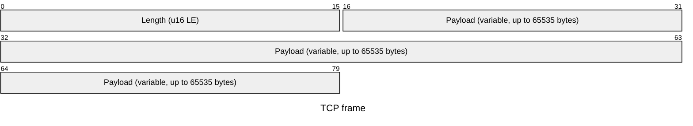
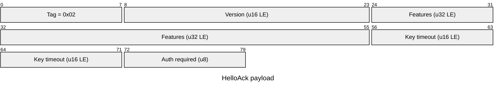
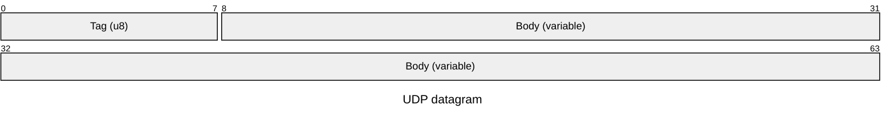
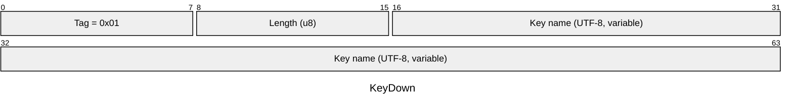
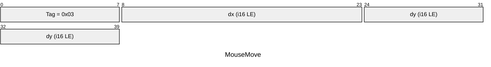

# Wire Protocol

Spud uses two channels between client and server, both on the same configured
port:

* **TCP control plane** for the handshake (version + feature negotiation) and
  liveness signal.
* **UDP input plane** for input events streamed from the client to the server.

A client must complete the TCP handshake before its UDP packets are accepted.
The server tracks the source IP of every authorized control connection; UDP
datagrams from any other source are dropped.

All multi-byte integers are little-endian.

## Constants

| Name               | Value            | Purpose                                  |
|--------------------|------------------|------------------------------------------|
| `PROTOCOL_VERSION` | `1`              | Highest version this build understands.  |
| `FEATURES`         | `0`              | Feature bitmap. No features defined yet. |
| `CTRL_HELLO`       | `0x01`           | Client handshake opening.                |
| `CTRL_HELLO_ACK`   | `0x02`           | Server handshake reply.                  |
| `CTRL_AUTH_FAILED` | `0x03`           | Server auth rejection.                   |
| `KEY_TIMEOUT`      | `1 s`            | Server releases held keys with no recent activity. |
| Heartbeat interval | `500 ms`         | Client refresh cadence for held keys.    |
| Connect timeout    | `5 s`            | Client TCP connect + handshake budget.   |

## TCP control plane

### Framing

Every control message is a length-prefixed payload:

`length` is the size of `payload` in bytes. Maximum payload is 65535 bytes.

The payload itself starts with a 1-byte tag identifying the message type.

### Messages

#### `0x01` Hello (client -> server)

Sent immediately by the client after the TCP connection is established.

* `Version`: highest protocol version the client supports.
* `Features`: feature bitmap the client wishes to advertise.
* `Auth length`: length of the passphrase in bytes. `0` when authentication is not configured on the client.
* `Auth bytes`: the plaintext passphrase. The server verifies it against its stored Argon2 hash.

#### `0x02` HelloAck (server -> client)

Reply to a valid `Hello`.

* `Version`: negotiated protocol version, defined as
  `min(client.version, server.version)`. A value of `0` means the server is
  unwilling to proceed; the client must treat the connection as failed.
* `Features`: negotiated feature bitmap, defined as
  `client.features & server.features`.
* `Key timeout`: server key-release timeout in milliseconds.
* `Auth required`: `1` if the server has authentication enabled, `0` otherwise.
  The client may refuse to proceed if it requires authentication but the server
  does not advertise it.

#### `0x03` AuthFailed (server -> client)

Sent by the server when the client provides an incorrect or missing passphrase
while the server has `require_auth` enabled. The server closes the TCP
connection immediately after sending this message.

### Lifecycle

1. Client opens a TCP connection (with `TCP_NODELAY`) to `host:port` within the
   connect timeout.
2. Client sends `Hello` (including passphrase if `require_auth` is enabled).
3. Server verifies the passphrase when `require_auth` is enabled:
   * If valid: server sends `HelloAck` and records the peer IP.
   * If invalid or missing: server sends `AuthFailed` and closes the connection.
4. Client reads the server's reply. `AuthFailed` is reported as an authentication
   error in the UI.
5. Client opens a UDP socket and `connect()`s it to the same `host:port`. UDP
   packets may now flow.
6. Both sides keep the TCP socket open as a liveness signal. Either side
   closing it terminates the session.
7. When the server observes the TCP stream close, it removes the peer IP from
   its authorized set; subsequent UDP packets from that IP are dropped.
8. The client also reads from the TCP socket in a background thread; an `EOF`
   or read error surfaces as a `Disconnected` event in the UI.

The control channel is currently silent after `HelloAck`. Future work may add
control messages for things like clipboard sync or screen geometry.

## UDP input plane

Each datagram carries exactly one event. There is no length prefix or framing
beyond the UDP boundary itself. Events from sources whose IP is not in the
authorized set are silently dropped.

### Datagram layout

### Events

#### `0x01` KeyDown

`Length` is the byte length (0..=255) of a UTF-8 key name (see
[Key naming](#key-naming)).

#### `0x02` KeyUp

Same layout as `KeyDown`, with tag `0x02`.

#### `0x06` KeyRepeat

Same layout as `KeyDown`, with tag `0x06`. Refreshes the server's "this key is
held" timer; emitted by the client heartbeat. The OS auto-repeat events are
deliberately *not* forwarded.

#### `0x03` MouseMove

Relative deltas in pixels.

#### `0x04` MouseButton

* `Button`: button code. Maps to evdev-like values: `1`=left, `2`=middle,
  `3`=right, `8`=back, `9`=forward.
* `Pressed`: `1` for press, `0` for release.

#### `0x05` Wheel

Discrete scroll deltas. Lines are passed through; pixel deltas are divided by
10. Both axes are clamped to `i8` range.

## Key naming

Keys are transmitted as opaque UTF-8 strings. The client picks a name based on
how the event was sourced:

* iced character keys: the character text (`"a"`, `"A"`, `"/"`).
* iced named keys: the debug name of the `iced::keyboard::key::Named` variant
  (`"Shift"`, `"ArrowLeft"`, `"F1"`, `"Backspace"`).
* Wayland / X11 backend keys: `"evdev:<keycode>"` where `<keycode>` is the
  raw evdev numeric code.

The server treats the strings as opaque identifiers; it does not try to
interpret them.

## Server key state machine

The server maintains a single `HashMap<String, Instant>` of keys that are
currently considered held. On each datagram and on each idle tick of the recv
loop, it runs the rules below and prints the resulting actions.

| Incoming event       | Held already? | Action                                                    |
|----------------------|---------------|-----------------------------------------------------------|
| `KeyDown(name)`      | no            | `press name`; insert with current time.                   |
| `KeyDown(name)`      | yes           | `release name (lost up)`, `press name`; refresh time.     |
| `KeyRepeat(name)`    | yes           | `repeat name`; refresh time.                              |
| `KeyRepeat(name)`    | no            | `press name (repeat without prior down)`; insert.         |
| `KeyUp(name)`        | yes           | `release name`; remove from map.                          |
| `KeyUp(name)`        | no            | (ignored)                                                 |

After processing a datagram, and after every idle wake of the recv loop
(approximately every 200 ms), the server sweeps the map: any key whose last
recorded time is older than `KEY_TIMEOUT` is released with
`release name (timeout)` and removed.

Currently the server only logs these actions; it does not synthesize input on
the host. That comes later.

## Client behavior

### Sending input

The client maintains `pressed_keys: HashSet<String>`.

* On a native key press event, if the name is not already in the set, insert
  it and send `KeyDown`. If it is already present (OS auto-repeat), the event
  is suppressed.
* On a native key release event, remove the name and send `KeyUp`.
* Every `500 ms` while a session is active, send `KeyRepeat` for every name
  in `pressed_keys`. This is the only source of `KeyRepeat` traffic.
* On `Disconnect` or `ConnectionLost`, clear `pressed_keys`.

This keeps held-key traffic at roughly 2 packets per second per held key,
regardless of OS auto-repeat rate, while the heartbeat still allows one
dropped UDP datagram before the server times the key out (heartbeat 500 ms,
timeout 1 s).

### Mouse

* In hotkey mode on Wayland, motion comes from the relative pointer protocol
  via the dedicated input thread; the iced `CursorMoved` events are not used.
* In focus mode, iced delivers absolute cursor positions, which the client
  converts to deltas against the previous position. The first event after a
  `CursorEntered` is suppressed because there is no prior reference.
* Buttons and wheel events are translated directly.

## Versioning

`PROTOCOL_VERSION = 1` is the only version defined. The handshake is designed
so that future server versions can negotiate down to `1` for older clients,
and clients can refuse to proceed if the server returns `0`.

Feature flags will use the bitmap in `Hello`/`HelloAck` once concrete features
are introduced. The current implementation negotiates them with `client &
server` but does not consult the result.
